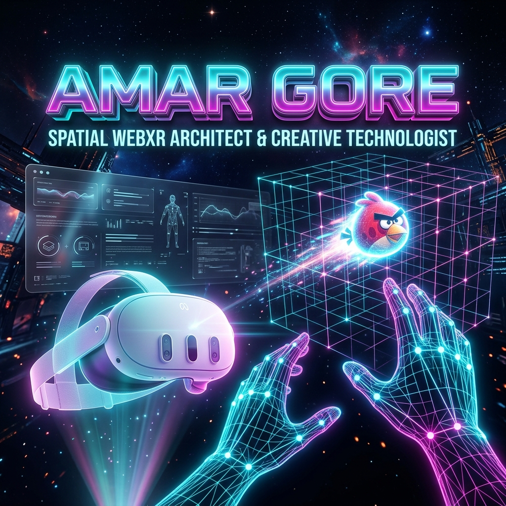

<div align="center">

  <!-- Mindblowing 3D WebXR Hero Banner -->
  <a href="https://amar-gore-prortfolio.vercel.app">
    
  </a>

  <br/><br/>

  <!-- Animated Cyberpunk Typing Text -->
  <a href="https://github.com/AmarGore47">
    
  </a>

  <p align="center">
    <code><b>[ 🥽 QUEST 3S HAND TRACKING: ACTIVE ]</b></code> &nbsp;•&nbsp; 
    <code><b>[ 🌐 WEBXR 3D ENGINE: ONLINE ]</b></code> &nbsp;•&nbsp; 
    <code><b>[ ⚡ SPATIAL MATRIX: READY ]</b></code>
  </p>

  <!-- High-Impact Glassmorphic Badges -->
  <p align="center">
    <a href="https://amar-gore-prortfolio.vercel.app" target="_blank">
      
    </a>
    <a href="https://github.com/AmarGore47">
      
    </a>
    <a href="https://github.com/AmarGore47/Vr_Game">
      
    </a>
    <a href="mailto:amargore.dev@gmail.com">
      
    </a>
  </p>

  
</div>

<br/>

## 🖐️ Bare-Hand Gesture Engine Architecture (Meta Quest 3S)

```text
               ┌────────────────────────────────────────────────────────┐
               │    QUEST 3S WEBCAM / HAND-TRACKING SENSOR MATRIX       │
               └───────────────────────────┬────────────────────────────┘
                                           │
                                  (21 HAND LANDMARKS)
                                           │
       ┌───────────────────────────────────┴───────────────────────────────────┐
       │                                                                       │
[THUMB TIP LANDMARK #4] ──┐                                         [INDEX TIP LANDMARK #8]
                          ├───> (PINCH GESTURE DETECTED: DISTANCE < 0.02m) ───┤
                          │                                                   │
                          └─────────────── (GRAB VR SLINGSHOT POUCH) ─────────┘
                                                   │
                                     [PULL BACK Z-AXIS VECTOR]
                                                   │
                                      (OPEN FINGERS TO RELEASE)
                                                   │
                                 ▼▼▼▼▼▼▼▼▼▼▼▼▼▼▼▼▼▼▼▼▼▼▼▼▼▼▼▼▼▼▼▼▼
                                 [LAUNCH 3D ANGRY BIRD VR PHYSICS]
                                 ▲▲▲▲▲▲▲▲▲▲▲▲▲▲▲▲▲▲▲▲▲▲▲▲▲▲▲▲▲▲▲▲▲
```

---

## 🥽 Spatial Tech Stack & 3D Arsenal

<div align="center">

### 🌐 WebXR, 3D & Vision Engines


### 💻 Full-Stack & Creative Engineering


</div>

---

## 🎮 Masterpiece Project Showcase

<table>
  <tr>
    <td width="50%" valign="top">
      <h3 align="center">🥽 XR Slingshot VR (Meta Quest 3S)</h3>
      <p align="center">
        <strong>Controller-Free Bare-Hand Tracking Angry Birds VR Game!</strong> Pinch thumb and index fingers to grab the slingshot pouch, pull back, and fire birds with real-time 3D physics, TNT explosive chain-reactions, and zero-dependency Web Audio API sound synthesis.
      </p>
      <p align="center">
        <code>A-Frame 1.6</code> • <code>Three.js</code> • <code>Hand Tracking</code> • <code>Web Audio API</code>
      </p>
      <p align="center">
        <a href="https://github.com/AmarGore47/Vr_Game"><strong>🎮 Explore VR Game Repo »</strong></a>
      </p>
    </td>
    <td width="50%" valign="top">
      <h3 align="center">🖐️ Hand-Tracking AR Cricket</h3>
      <p align="center">
        Real-time webcam hand gesture tracking AR experience for playing cricket using computer vision keypoint detection & WebGL collision physics.
      </p>
      <p align="center">
        <code>MediaPipe</code> • <code>Computer Vision</code> • <code>WebXR</code> • <code>JavaScript</code>
      </p>
      <p align="center">
        <a href="https://github.com/AmarGore47/Hand-tracking-AR-cricket-experience"><strong>🏏 Explore AR Cricket Repo »</strong></a>
      </p>
    </td>
  </tr>
  <tr>
    <td width="50%" valign="top">
      <h3 align="center">📐 Floor Projection Interactive</h3>
      <p align="center">
        Interactive motion-tracking floor projection mapping system capturing user movement for real-time visual reactions & floor graphics.
      </p>
      <p align="center">
        <code>Interactive Projection</code> • <code>Motion Sensors</code> • <code>Canvas 2D</code>
      </p>
      <p align="center">
        <a href="https://amargore47.github.io/floor-projection-interactive/"><strong>🔗 Live Projection Demo »</strong></a> •
        <a href="https://github.com/AmarGore47/floor-projection-interactive"><strong>📁 Repo »</strong></a>
      </p>
    </td>
    <td width="50%" valign="top">
      <h3 align="center">🎨 3D Developer Portfolio</h3>
      <p align="center">
        Personal developer portfolio featuring 3D animated cards, smooth WebGL shader transitions, glassmorphic UI & spatial project showcases.
      </p>
      <p align="center">
        <code>Next.js</code> • <code>TypeScript</code> • <code>Three.js</code> • <code>Tailwind</code>
      </p>
      <p align="center">
        <a href="https://amar-gore-prortfolio.vercel.app"><strong>🔗 Live Portfolio »</strong></a> •
        <a href="https://github.com/AmarGore47/Amar_Gore_Prortfolio"><strong>📁 Repo »</strong></a>
      </p>
    </td>
  </tr>
</table>

---

## 📊 Matrix Cyberpunk Analytics

<div align="center">
  
  
</div>

<br/>

<div align="center">
  
</div>

---

## 🐍 Contribution Grid Matrix

<div align="center">
  
</div>

---

## 🕹️ Interactive CLI & Terminal System

<details>
<summary>⚡ <b>Click to Access VR Developer Cyber Terminal & Secrets!</b></summary>

<br/>

```bash
$ npx amar-gore --info

[SYS_INFO] Initializing Spatial Neural Link...
[SYS_INFO] User: Amar Gore
[SYS_INFO] Specialization: WebXR Slingshot VR, Quest 3S Hand Tracking, AR Games
[SYS_INFO] VR Headset: Meta Quest 3S
[SYS_INFO] Weapon of Choice: Three.js + A-Frame + Procedural Web Audio API
[SYS_INFO] Current Mission: Creating zero-controller hand tracking WebXR experiences!
```

- 🥽 **Quest 3S Secret**: Did you know hand tracking in Quest 3S allows pinching index and thumb fingers to simulate real rubber slingshot tension?
- 🔊 **Audio Magic**: Built custom Web Audio API synthesizer for zero-dependency sound effects!
- 🎯 **Future Vision**: Bringing full console-grade 3D physics directly into mobile and Quest browsers!

</details>

<details>
<summary>📬 <b>Establish Quantum Link (Contact Me)</b></summary>

<br/>

- 📧 **Email**: [amargore.dev@gmail.com](mailto:amargore.dev@gmail.com)
- 🌐 **Interactive Portfolio**: [amar-gore-prortfolio.vercel.app](https://amar-gore-prortfolio.vercel.app)
- 💼 **LinkedIn**: [Connect with Amar Gore](https://linkedin.com)
- 🥽 **GitHub VR Repo**: [Vr_Game Project](https://github.com/AmarGore47/Vr_Game)

</details>

---

<div align="center">
  
</div>

<br/>

<div align="center">
  <sub>⚡ Engineered by <a href="https://github.com/AmarGore47">Amar Gore</a> | Built for Meta Quest 3S & Spatial Computing Excellence 🥽</sub>
</div>
